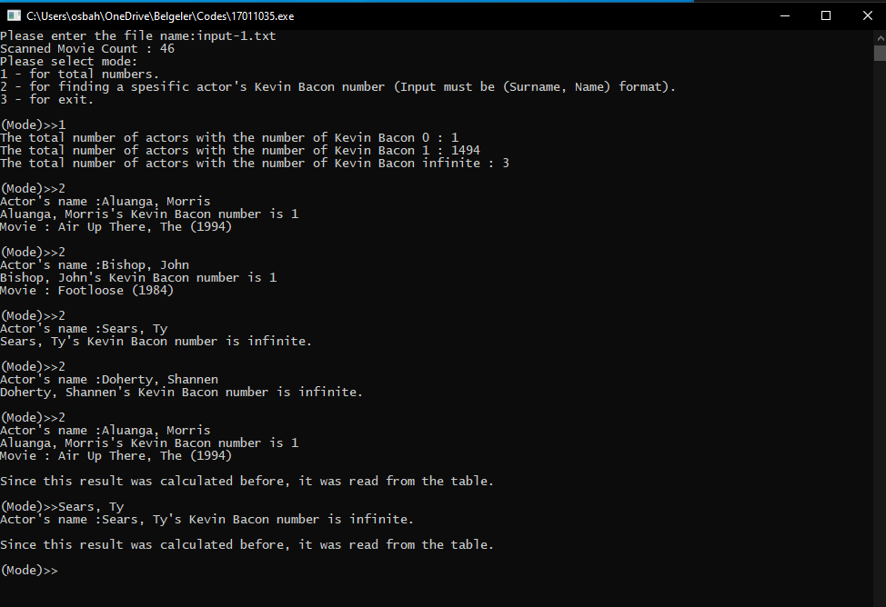
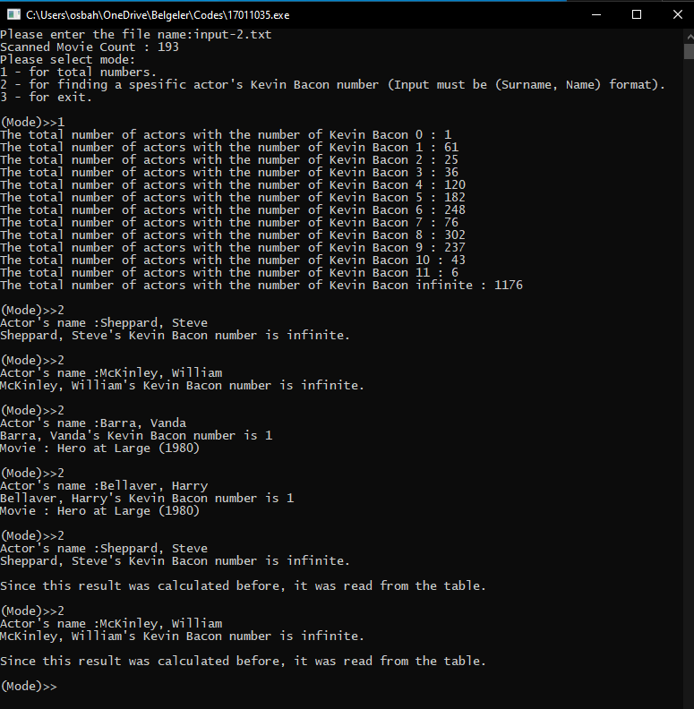
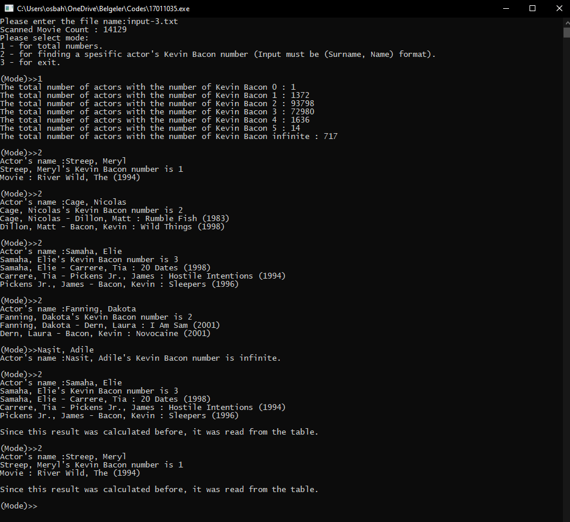

# Graph Implementation with Small World Phenomenon
> Graph implementation with a small-world phenomenon, finding Kevin Bacon numbers in the given txt file using breadth-first search.

## What is small-world phenomenon

The small-world experiment comprised several experiments conducted by Stanley Milgram and other researchers examining the average path length for social networks of people in the United States. The research was groundbreaking in that it suggested that human society is a small-world-type network characterized by short path-lengths. The experiments are often associated with the phrase "six degrees of separation", although Milgram did not use this term himself.

### What is six degrees of Kevin Bacon

Six Degrees of Kevin Bacon or "Bacon's Law" is a parlour game based on the "six degrees of separation" concept, which posits that any two people on Earth are six or fewer acquaintance links apart. Movie buffs challenge each other to find the shortest path between an arbitrary actor and prolific actor Kevin Bacon. It rests on the assumption that anyone involved in the Hollywood film industry can be linked through their film roles to Bacon within six steps. In 2007, Bacon started a charitable organization called SixDegrees.org. In 2020, Bacon started a podcast called The Last Degree of Kevin Bacon.

## Used Technologies

I used the C programming language in this project because it is a low-level language, and it is a challenge for me. Graph implementation in C is complicated but improving.

## How the program works

- Reads movies and actors from the txt file and creates a graph.
- Performs breadth-first search on the graph and finds given names Kevin Bacon number. If the file does not include the given name, it says it's Kevin Bacon number is infinite.
- Saves the calculated results to a struct when a query performed and if the same query shows, it does not calculate again, prints from struct.

## Screenshots

